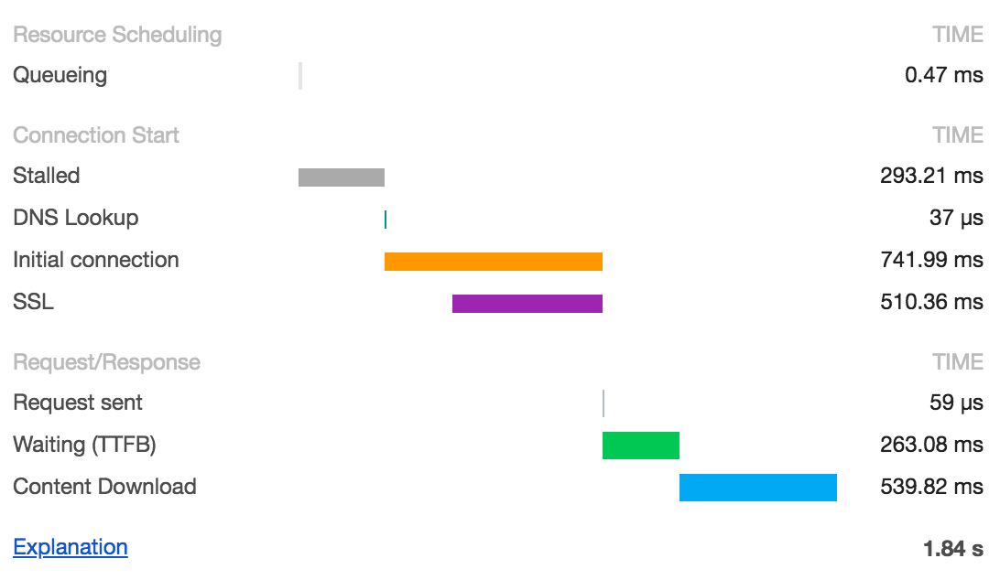

# Frontend
## Part 1: BFE fundamental
| # | Category | # | Questions |
|:-:|:--------:|:-:|-----------|
| 1 | Utility  | 1 | 1. Implement curry() |
|   |          | 2 | 2. Implement curry() with placeholder support |
|   |          | 3 | 3. Implement Array.prototype.flat() |
|   |          | 4 | 4. Implement basic throttle() |
|   |          | 5 | 5. Implement throttle() with leading & trailing option |
|   |          | 6 | 6. Implement basic debounce() |
|   |          | 7 | 7. Implement debounce() with leading & trailing option |
|   |          | 8 | 11. Implement pipe() |
|   |          | 9 | 12. Implement Immutability helper |
|   |          | 10 | 14. Implement memo() |
|   |          | 11 | 15. Implement jQuery DOM wrapper |
|   |          | 12 | 17. Create a simple store for DOM element |
|   |          | 13 | 20. Detect data type in JavaScript |
|   |          | 14 | 22. Implement JSON.parse() |
|   |          | 15 | 23. Create a sum() |
|   |          | 16 | 24. Create a Priority Queue in JavaScript |
|   |          | 17 | 26. Implement Object.assign() |
|   |          | 18 | 46. Implement _.once() |
|   |          | 19 | 54. Flatten Thunk |
|   |          | 20 | 63. Create _.cloneDeep() |
|   |          | 21 | 69. Implement deep equal _.isEqual() |
|   |          | 22 | 85. Implement _.get() |
|   |          | 23 | 122. Implement memoizeOne() |
|   |          | 24 | 125. Implement classNames() |
| 2 | DOM Manipulation | 1 | 19. Find corresponding node in two identical DOM tree |
|   |                  | 2 | 58. Get DOM tree height |
|   |                  | 3 | 68. Get DOM tags |
|   |                  | 4 | 89. Next Right Sibling |
|   |                  | 5 | 104. Traverse DOM level by level |
|   |                  | 6 | 113. Virtual DOM I |
|   |                  | 7 | 118. Virtual DOM II - createElement |
| 3 | Async Utility | 1 | 29. Implement sequence() |
|   |               | 2 | 30. Implement parallel() |
|   |               | 3 | 31. Implement race() |
|   |               | 4 | 56. Call APIs with pagination |
|   |               | 5 | 101. Merge identical API calls |
| 4 | Promise       | 1 | 32. Implement Promise.all() |
|   |               | 2 | 33. Implement Promise.allSettled() |
|   |               | 3 | 34. Implement Promise.any() |
|   |               | 4 | 35. Implement Promise.race() |
|   |               | 5 | 64. Auto-retry Promise on rejection |
|   |               | 6 | 67. Create your own Promise |
|   |               | 7 | 92. Throttle Promises |
|   |               | 8 | 123. Implement Promise.prototype.finally() |
| 5 | Timer         | 1 | 28. Implement clearAllTimeout() |
|   |               | 2 | 36. Create a fake timer (setTimeout) |
|   |               | 3 | 83. Create an interval |
|   |               | 4 | 84. Create a fake timer (setInterval) |
|   |               | 5 | 130. Create LazyMan() |
|   |               | 6 | Implement a stopwatch |
| 6 | Sorting       | 1 | 40. Bubble Sort |
|   |               | 2 | 41. Merge Sort |
|   |               | 3 | 42. Insertion Sort |
|   |               | 4 | 43. Quick Sort |
|   |               | 5 | 44. Selection Sort |
| 7 | HTML manipulation | 1 | 55. Highlight keywords in HTML string |
|   |                   | 2 | 99. Extract all anchor element form HTML string |
| 8 | Browser       | 1 | 59. Create a browser history |
|   |               | 2 | 80. Implement your own URLSearchParams |
|   |               | 3 | 117. Event Delegation |
|   |               | 4 | 134. Create your own Cookie |
|   |               | 5 | 135. localStorage with expriration |
| 9 | PubSub        | 1 | 16. Create an Event Emitter |
|   |               | 2 | 56. Create an Observable |
|   |               | 3 | 71. Implement Observable Subject |

## Part 2: Widget Design
| # | Question | Pure JS | React | Fetch data | Pure CSS |
|:-:|----------|:-------:|:-----:|:----------:|:--------:|
| 1 | Light out game | &check; | &check; | - | - |
| 2 | Calendar | &check; |  | - | - |
| 3 | Tic Tac Toe Game |  | &check; | - |  |
| 4 | Star rating |  |  | - | &check; |
| 5 | Poll |  |  | - |  |
| 6 | Light box |  |  | - |  |
| 7 | Click outside to close drop down |  |  | - |  |
| 8 | Accordion |  |  | - |  |
| 9 | Infinite scroller |  |  | - |  |
| 10 | Carousel |  |  | &check; |  |
| 11 | Todo app CRUD |  |  | &check; |  |
| 12 | Autocompolete |  |  | &check; |  |
| 13 | Fuzzy search |  |  | &check; |  |
| 14 | Excel table (calculated cell, sort, filter) |  |  | &check; |  |
| 15 | Download Progress bar |  |  | &check; |  |
| 16 | File uploader |  |  | &check; |  |

## Part 3: Performance



### Metrics:
| # | Name | Definition | Measure | Diagnose | Fix |
|:-:|------|------------|---------|----------|-----|
| 1 | Time to First Byte (TTFB) | the time between HTTP GET and first byte of response received aka (Wait) | | | |
| 2 | First Paint (FP) | the time first pixel rendered on the screen (usually background color. JS not ready yet) | | | |
| 3 | First Contentful Paint (FCP) | the time content from DOM rendered on the screen (text/image/svg) | | | |
| 4 | First Meaningful Paint (FMP) | the time primary content rendered on the screen(developer defined) | | | |
| 5 | Time to Interactive (TTI) | the time large JS chunks have finished  | | | |
| 6 | Total Blocking Time (TBT) | the time between FP and TTI | | | |
| 7 | Largest Contentful Paint (LCP) | the time largest node rendered (measures loading performance) | | | |
| 8 | First Input Delay (FID) | (measures interactivity) | only tested in field | | |
| 9 | Cumulative Layout Shift (CLS) | (measures visual stability) | | | |
## Part 4: System Design
### 1. API
### 2. Async query function:
```js
const GetPostList = async () => {
  const response = await fetch('http://hostname/api/posts/');
  const data = await response.json();
  return data;
}
```
### 3. Query Promise wrapper: ```useQuery(queryKey['todos', todoId], queryFn)```
### 4. Component: 
```React.createElement(componentName, props: attribute | eventListener, ...children): virtualElement```
```js
function({props}) { 
  let state = {};
  return virtualElement;
}
```
### 5. Virtual Element:
```ts
interface {
  key: 'unique key',
  props: {
    children: [children node],
    eventListener: () => {}
  },
  ref: 'actual DOM',
  type: 'ComponentName'
}
```
### 6.1 Client-side State management
1. atom: 
```ts
const countAtom = atom(0);
const [count, setCount] = useAtom(countAtom);
```
2. pipe: 
```ts
const countAtom1 = atom(1);
const countAtom2 = atom(2);

const countTotalAtom = atom(get => get(countAtom1) + get(countAtom2));
```
### 6.2 Reconciler and linked list:
1. ```createNodeFromTypeAndProps(virtualElement) => LinkedListNode```

2. ```updateHostComponent(current, workInProgress)```

3. Linked List Node:
```ts
interface {
  stateNode: new ComponentName,
  type: 'ComponentName',
  alternate: 'WorkInProgress Node',
  key: 'unique key',
  updateQueue: [],
  memoizedState: {},
  pendingProps: {
    children: [children node],
    eventListener: () => {},
  },
  memoizedProps: {
    children: [children node],
    eventListener: () => {},
  },
  tag: number,
  effectTag: number,
  nextEffectTag: number
}
```
4. Phases: 
    1. Render Phase:

        Run ```updateHostComponent(current, workInProgress)```

    2. Commit Phase:

        Traverse effect list to perform DOM mutation and async request. Start when 

        1. After component mounted
        2. After component updated
        3. Before component unmounted

### Design principles:
1. Seperation of Concerns
2. Command-Query separation
3. Optimized for Change

1. View/component
2. Functionality/jotai
3. Connection
  3.1 Long/short polling (client pull):
  Command/Query warpper + Async request function
  3.2 WebSockets (server push):
  WebSocket
  3.3 Server-Sent events (server push):
  new EventSource()
4. Gateway API:
    Read server
    Write server

### Examples:
1. Twitter/Facebook/Instagram (User, Post, Friendship, Media)
2. WhatsApp (Real time Chat service, User, Message, Frinedship, Status, Channel)
3. Netflix (Real time stream service, Video)
4. Uber/Yelp (Location based service, Geo, Dispatch)
5. Airbnb (Hotel booking service, Search, Book)
6. Robinhood (Real time market data service)
7. Gmail (Message, Thread, Label, Draft)
8. Google document (Collaborative editing service, Format, Git, Concurrency)
9. Youtube (Recomendation, Video)
