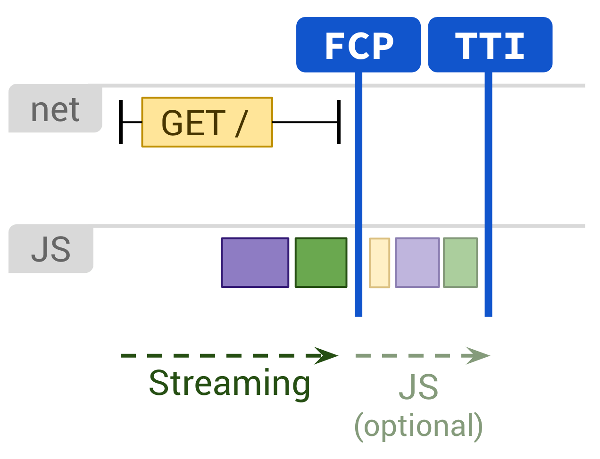
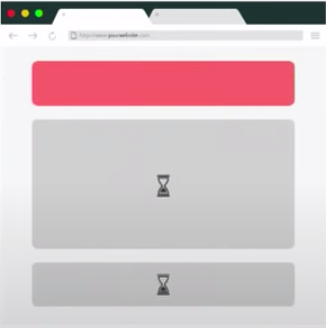
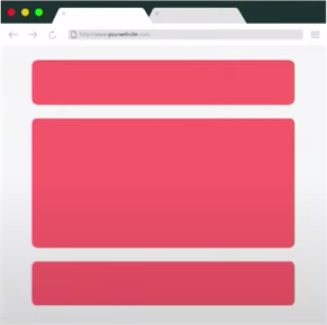
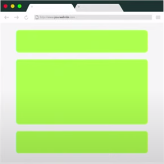
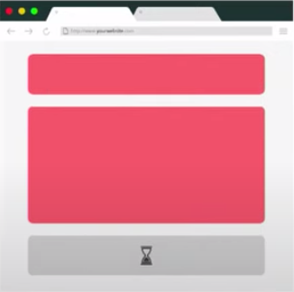
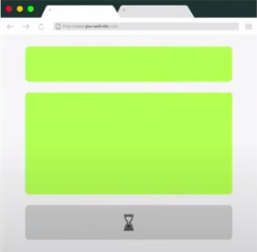
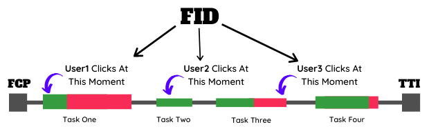
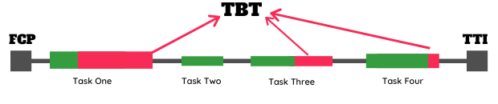

# Frontend
## Part 1: BFE fundamental
| # | Category | # | Questions |
|:-:|:--------:|:-:|-----------|
| 1 | Utility  | 1 | 1. Implement curry() |
|   |          | 2 | 2. Implement curry() with placeholder support |
|   |          | 3 | 3. Implement Array.prototype.flat() |
|   |          | 4 | 4. Implement basic throttle() |
|   |          | 5 | 5. Implement throttle() with leading & trailing option |
|   |          | 6 | 6. Implement basic debounce() |
|   |          | 7 | 7. Implement debounce() with leading & trailing option |
|   |          | 8 | 11. Implement pipe() |
|   |          | 9 | 12. Implement Immutability helper |
|   |          | 10 | 14. Implement memo() |
|   |          | 11 | 15. Implement jQuery DOM wrapper |
|   |          | 12 | 17. Create a simple store for DOM element |
|   |          | 13 | 20. Detect data type in JavaScript |
|   |          | 14 | 22. Implement JSON.parse() |
|   |          | 15 | 23. Create a sum() |
|   |          | 16 | 24. Create a Priority Queue in JavaScript |
|   |          | 17 | 26. Implement Object.assign() |
|   |          | 18 | 46. Implement _.once() |
|   |          | 19 | 54. Flatten Thunk |
|   |          | 20 | 63. Create _.cloneDeep() |
|   |          | 21 | 69. Implement deep equal _.isEqual() |
|   |          | 22 | 85. Implement _.get() |
|   |          | 23 | 122. Implement memoizeOne() |
|   |          | 24 | 125. Implement classNames() |
| 2 | DOM Manipulation | 1 | 19. Find corresponding node in two identical DOM tree |
|   |                  | 2 | 58. Get DOM tree height |
|   |                  | 3 | 68. Get DOM tags |
|   |                  | 4 | 89. Next Right Sibling |
|   |                  | 5 | 104. Traverse DOM level by level |
|   |                  | 6 | 113. Virtual DOM I |
|   |                  | 7 | 118. Virtual DOM II - createElement |
| 3 | Async Utility | 1 | 29. Implement sequence() |
|   |               | 2 | 30. Implement parallel() |
|   |               | 3 | 31. Implement race() |
|   |               | 4 | 56. Call APIs with pagination |
|   |               | 5 | 101. Merge identical API calls |
| 4 | Promise       | 1 | 32. Implement Promise.all() |
|   |               | 2 | 33. Implement Promise.allSettled() |
|   |               | 3 | 34. Implement Promise.any() |
|   |               | 4 | 35. Implement Promise.race() |
|   |               | 5 | 64. Auto-retry Promise on rejection |
|   |               | 6 | 67. Create your own Promise |
|   |               | 7 | 92. Throttle Promises |
|   |               | 8 | 123. Implement Promise.prototype.finally() |
| 5 | Timer         | 1 | 28. Implement clearAllTimeout() |
|   |               | 2 | 36. Create a fake timer (setTimeout) |
|   |               | 3 | 83. Create an interval |
|   |               | 4 | 84. Create a fake timer (setInterval) |
|   |               | 5 | 130. Create LazyMan() |
|   |               | 6 | Implement a stopwatch |
| 6 | Sorting       | 1 | 40. Bubble Sort |
|   |               | 2 | 41. Merge Sort |
|   |               | 3 | 42. Insertion Sort |
|   |               | 4 | 43. Quick Sort |
|   |               | 5 | 44. Selection Sort |
| 7 | HTML manipulation | 1 | 55. Highlight keywords in HTML string |
|   |                   | 2 | 99. Extract all anchor element form HTML string |
| 8 | Browser       | 1 | 59. Create a browser history |
|   |               | 2 | 80. Implement your own URLSearchParams |
|   |               | 3 | 117. Event Delegation |
|   |               | 4 | 134. Create your own Cookie |
|   |               | 5 | 135. localStorage with expriration |
| 9 | PubSub        | 1 | 16. Create an Event Emitter |
|   |               | 2 | 56. Create an Observable |
|   |               | 3 | 71. Implement Observable Subject |

## Part 2: Widget Design
| # | Question                                     | Pure JS |  React  | React Testing | Fetch data | Trasition |
|:-:|----------------------------------------------|:-------:|:-------:|:-------------:|:----------:|:---------:|
| 1 | Light out game                               | &check; | &check; |     @TODO     |   @TODO    |   @TODO   |
| 2 | Calendar                                     | &check; | &check; |     &check;   |   @TODO    |   @TODO   |
| 3 | Tic Tac Toe Game                             |  @TODO  | &check; |     @TODO     |   @TODO    |   @TODO   |
| 4 | Star rating                                  |    -    |    -    |       -       |     -      |   @TODO   |
| 5 | Poll                                         |  @TODO  | &check; |     @TODO     |   &check;  |   @TODO   |
| 6 | Light box                                    |  @TODO  | &check; |     @TODO     |   &check;  |   @TODO   |
| 7 | Click outside to close drop down             |  @TODO  | &check; |     &check;   |   &check;  |   @TODO   |
| 8 | Accordion                                    |  @TODO  |  @TODO  |     @TODO     |   @TODO    |   @TODO   |
| 9 | Carousel                                     |  @TODO  | &check; |     @TODO     |   &check;  |   @TODO   |
| 10 | Download Progress bar                       |  @TODO  |  @TODO  |     @TODO     |   @TODO    |   @TODO   |
| 11 | Toast Notification                          |  @TODO  | &check; |     @TODO     |   &check;  |   @TODO   |
| 12 | Snake Game                                  |  @TODO  |  @TODO  |     @TODO     |   @TODO    |   @TODO   |
| 13 | Excel table (calculated cell, sort, filter) |  @TODO  |  @TODO  |     @TODO     |   @TODO    |   @TODO   |
| 14.a | Todo app CRUD                             |  @TODO  | &check; |     @TODO     |   &check;  |   @TODO   |
| 14.b | Render JSON server data                   |  @TODO  |  @TODO  |     @TODO     |   @TODO    |   @TODO   |
| 14.c | Infinite scroller                         |  @TODO  |  @TODO  |     @TODO     |   @TODO    |   @TODO   |
| 14.d | File uploader                             |  @TODO  |  @TODO  |     @TODO     |   @TODO    |   @TODO   |
| 14.e | Pagination                                |  @TODO  |  @TODO  |     @TODO     |   @TODO    |   @TODO   |
| 14.f | Autocompcdlete                            |  @TODO  | &check; |     @TODO     |   @TODO    |   @TODO   |
| 14.g | Fuzzy search                              |  @TODO  | &check; |     @TODO     |   @TODO    |   @TODO   |

## Part 3: Performance
### What happend when enter a url:


<br>
### Server Rendering:
<br>
### Static Rendering:
<br>
### Client Rendering:
<br>
### Progressive Rendering with placeholders and one time hydration:
1. Load initial page with placeholder on secondary contents.<br>

2. Finish loading all secondary contents.<br>

3. Hydration.<br>
<br>
### Progressive Hydration with React Concurrent Mode:
1. Load initial page with placeholder on secondary contents.<br>

2. Finish loading first secondary content.<br>

3. Progressive hydration with React Concurrent Mode.<br>
<br>
### Metrics:
| # | Name | Definition | Measure | Diagnose | Fix |
|:-:|------|------------|---------|----------|-----|
| 1 | Time to First Byte (TTFB) | the time between HTTP GET and first byte of response received aka (Wait) | 1. curl {time_starttransfer}<br> 2. `web-vitals` JS lib | 1. Slow DNS resolution<br> 2. Slow HTTPS redirection or certificate verification<br> 3. Slow database connection (for dynamic sites like WordPress)<br> 4. Poor disk performance (Disk I/O) of the server<br> 5. Poor network connection to the server<br> 6. Insufficient system resources (CPU and RAM) on the server | CDN |
| 2 | First Paint (FP) | the time first pixel rendered on the screen (usually background color. JS not ready yet) | 1. Chrome DevTools/Performance<br> 2. PageSpeed Insights<br> 3. Paint Timing API | see FCP | see FCP |
| 3 | First Contentful Paint (FCP) | the time content from DOM rendered on the screen (text/image/svg) | 1. `web-vitals` JS lib<br> 2. Chrome DevTools/Performance<br> 3. PageSpeed Insights<br> 4. Paint Timing API | 1. Long loading time<br> 2. Long rendering time | 1. Eliminate render-blocking resources<br> 2. Minify CSS<br> 3. Remove unused CSS<br> 4. Preconnect to required origins<br> 5. Reduce server response times(TTFB)<br> 6. Avoid multiple page redirects<br> 7. Preload key requests<br> 8. Avoid enormous network payloads<br> 9. Server static assests with an efficient cache policy<br> 10. Avoid an excessive DOM size<br> 11. Minimize critical request depth<br> 12. Ensure text remains visible during webfont load<br> 13. Keep request counts low and transfer sizes small<br> 14. Compress HTML/CSS/JS with gzip<br> 15. Lazy loading |
| 4 | First Meaningful Paint (FMP) | the time primary content rendered on the screen(developer defined) | ~=FCP | see FCP | see FCP |
| 5 | Time to Interactive (TTI) | the time large JS chunks have finished  | PageSpeed Insights<br> | Main thread is been used for too long | 1. Minify Javascript<br> 2. Preconnect to required origins<br> 3. Preload key requests<br> 4. Reduce the impact of third-party code<br> 5. Minimize critical request depth<br> 6. Reduce Javascript execution time<br> 7. Minimize main thread work<br> 8. Keep request counts low and transfer sizes small |
| 6 | Total Blocking Time (TBT) | the time between FP and TTI | Calculate from FP and TTI | see TTI | see TTI |
| 7 | Largest Contentful Paint (LCP) | the time largest node rendered (measures loading performance) | 1. `web-vitals` JS lib<br> 2.Chrome DevTools/Performance<br> 3.PageSpeed Insights<br> | 1. SLow server response times<br> 2. Render-blocking Javascript and CSS<br> 3. Resource load times<br> 4. Client-side rendering | 1. Appply instant loading with the PRPL pattern<br> 2. Optimizing the Critical Rendering Path<br> 3. Optimize your CSS<br> 4. Optimizee your images<br> 5. Optimize your Fonts<br> 6. Optimize your Javascript (for client-rendered sites) |
| 8 | First Input Delay (FID) | (measures interactivity) | 1. `web-vitals` JS lib<br> 2.PageSpeed Insights<br> | see TTI | see TTI |
| 9 | Cumulative Layout Shift (CLS) | (impact fraction) * (distance fraction) (measures visual stability) | 1. `web-vitals` JS lib<br> 2.PageSpeed Insights<br> | **Impact fraction**: Shifting content viewport percentage.<br>**Distance fraction**: Shifting distance viewport percentage. | 1. Always include size attributes on your images and video elements, or otherwise reserve the required space with something like CSS aspect ratio boxes.<br> 2. Never insert content above existing content, except in response to a user interaction.<br> 3. Prefer transform animations to animations of properties that trigger layout changes. |


## Part 4: System Design
### 1. API
### 2. Async query function:
```js
const GetPostList = async () => {
  const response = await fetch('http://hostname/api/posts/');
  const data = await response.json();
  return data;
}
```
### 3. Query Promise wrapper: ```useQuery(queryKey['todos', todoId], queryFn)```
### 4. Component: 
```React.createElement(componentName, props: attribute | eventListener, ...children): virtualElement```
```js
function({props}) { 
  let state = {};
  return virtualElement;
}
```
### 5. Virtual Element:
```ts
interface {
  key: 'unique key',
  props: {
    children: [children node],
    eventListener: () => {}
  },
  ref: 'actual DOM',
  type: 'ComponentName'
}
```
### 6.1 Client-side State management
1. atom: 
```ts
const countAtom = atom(0);
const [count, setCount] = useAtom(countAtom);
```
2. pipe: 
```ts
const countAtom1 = atom(1);
const countAtom2 = atom(2);

const countTotalAtom = atom(get => get(countAtom1) + get(countAtom2));
```
### 6.2 Reconciler and linked list:
1. ```createNodeFromTypeAndProps(virtualElement) => LinkedListNode```

2. ```updateHostComponent(current, workInProgress)```

3. Linked List Node:
```ts
interface {
  stateNode: new ComponentName,
  type: 'ComponentName',
  alternate: 'WorkInProgress Node',
  key: 'unique key',
  updateQueue: [],
  memoizedState: {},
  pendingProps: {
    children: [children node],
    eventListener: () => {},
  },
  memoizedProps: {
    children: [children node],
    eventListener: () => {},
  },
  tag: number,
  effectTag: number,
  nextEffectTag: number
}
```
4. Phases: 
    1. Render Phase:

        Run ```updateHostComponent(current, workInProgress)```

    2. Commit Phase:

        Traverse effect list to perform DOM mutation and async request. Start when 

        1. After component mounted
        2. After component updated
        3. Before component unmounted

### Design principles:
1. Seperation of Concerns
2. Command-Query separation
3. Optimized for Change

1. View/component
2. Functionality/jotai
3. Connection
  3.1 Long/short polling (client pull):
  Command/Query warpper + Async request function
  3.2 WebSockets (server push):
  WebSocket
  3.3 Server-Sent events (server push):
  new EventSource()
4. Gateway API:
    Read server
    Write server

### Examples:
1. Twitter/Facebook/Instagram (User, Post, Friendship, Media)
2. WhatsApp (Real time Chat service, User, Message, Frinedship, Status, Channel)
3. Netflix (Real time stream service, Video)
4. Pinterest (Image sharing service)